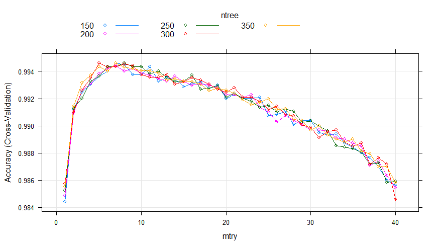

# Practical Machine Learning Course Project
Ahmed  
23-MAY-2016  


#Executive Summary

Using the Qualitative Activity Recognition of Weight Lifting Exercises dataset, two algorithms were applied (random forest and Stochastic Gradient Boosting Machine) to predict exercise quality for unknown observations. Both models resulted in a slightly similar accuracy rates for the training dataset with cross validation, and both techniques were abel to classify 20 out of 20 test (quiz) casses correctly.


# 1.0 Introduction

Using devices such as Jawbone Up, Nike FuelBand, and Fitbit it is now possible to collect a large amount of data about personal activity relatively inexpensively. These type of devices are part of the quantified self movement. a group of enthusiasts who take measurements about themselves regularly to improve their health, to find patterns in their behavior, or because they are tech geeks. One thing that people regularly do is quantify how much of a particular activity they do, but they rarely quantify how well they do it. In this project, your goal will be to use data from accelerometers on the belt, forearm, arm, and dumbell of 6 participants. They were asked to perform barbell lifts correctly and incorrectly in 5 different ways. More information is available from the <a href="http://groupware.les.inf.puc-rio.br/har">website here</a>. (see the section on the Weight Lifting Exercise Dataset).


## 1.1 Purpose

The main goal of this project is to use the the Weight Lifting Exercises Dataset to build model that predicts the manner (classes) in which the exercise performed. 
The 5 possible methods include -


|Class |Detale                                 |
|:-----|:--------------------------------------|
|A     |exactly according to the specification |
|B     |throwing the elbows to the front       |
|C     |lifting the dumbbell only halfway      |
|D     |lowering the dumbbell only halfway     |
|E     |throwing the hips to the front         |


The prediction model will be used to predict 20 different test cases (Quiz part).


# 2.0 Data Preperation
The training dataset , <a href="https://d396qusza40orc.cloudfront.net/predmachlearn/pml-training.csv">available here</a> , is used to build the prediction model to generate predictions for the  <a href="https://d396qusza40orc.cloudfront.net/predmachlearn/pml-testing.csv">testing set</a>.


```r
> training <- read.csv(training_file, na.strings = c("NA", "#DIV/0!", ""), header = TRUE)
> 
> # str(training); dim(training)
> 
> ## quiz set
> quiz <- read.csv(test_file, na.strings = c("NA", "#DIV/0!", ""), header = TRUE)
> 
> # dim(quiz)
```
The `training` dataset contains 160 variabels with 19622 observations. After inspecting the `training` data, there were  100 out of 160 variabels containing high ratios of missing values. These variabels are removed as there is no way to impute thes values.  The first 7 columns  were removed as well  since they are related to the time-series or are not numeric. 


```r
> ## remove the first 7 columns
> cdata <- training[, -c(1:7)]
> 
> ## remove columns with more than 70% missing data
> 
> cdata <- cdata[, colSums(is.na(cdata))/sapply(cdata, function(y) (length(y))) <= 
+     0.7]
```


# 3.0 Modeling

Two algorithms were applied (random forest and Stochastic Gradient Boosting ) to model the classification. The models were performed using k-fold cross validation method for estimating the out of sample error. With 5 foldes cross validation, the results are aggregated to create an overall estimate of the out of sample error. However, before training the models, the original `trainning` dataset was divided into two subsets, `train` data (75%) to be used for cross-validation and `test` data (25%) to check the generalization of the model.


```r
> # Data spliting In order to get out-of-sample errors, split the cleaned
> # training set training Data into a train set (train, 75%) for prediction
> # and a test set (valid 25%) to compute the out-of-sample errors.
> set.seed(100)
> 
> inTrain <- createDataPartition(y = cdata$classe, p = 0.75, list = FALSE)
> train <- cdata[inTrain, ]
> test <- cdata[-inTrain, ]
> 
> # dim(train) dim(test)
> 
> ## train control 5 cross-validation
> control <- trainControl(method = "cv", number = 5, allowParallel = TRUE)  ## allow parallel processing
```


## 3.1 Classification with Random Forest

One could tune the algorithm with different parameter combinations to find the optimum performance of a model for a given dataset. For this project, two tuning parameters that have the following affect on our random forest model were chosen:

* mtry: Number of variables randomly sampled as candidates at each split.
* ntree: Number of trees to grow.

Figure 1 below illustorates the results of the random forest model. Apperantly, there is no musch difference between the number of trees (150 - 350) with respect to the accuracy, however,  the accuracy was approxomatly held constant between the `mtry`  7 and 10 and then it decreases as the `mtry` increases.   




To reduce the complexity and avoid overrfitting of the model, I decided to proceed with 150 trees.   


```r
> library(caret)
> library(doParallel)
> 
> ## mtry 6:8
> gridRF <- expand.grid(mtry = c(6:8))
> 
> ## parallel processing with 2 cores
> cl <- makePSOCKcluster(2)
> registerDoParallel(cl)
> 
> set.seed(100)
> 
> ## random fores model
> rf_random <- train(classe ~ ., data = train, method = "rf", tuneGrid = gridRF, 
+     ntree = 150, trControl = control)
> stopCluster(cl)
> 
> ## results of the model
> rf_random$finalModel
```


```

Call:
 randomForest(x = x, y = y, ntree = 150, mtry = param$mtry) 
               Type of random forest: classification
                     Number of trees: 150
No. of variables tried at each split: 8

        OOB estimate of  error rate: 0.6%
Confusion matrix:
     A    B    C    D    E class.error
A 4180    3    0    1    1 0.001194743
B   14 2827    7    0    0 0.007373596
C    0   16 2545    6    0 0.008570316
D    0    0   25 2385    2 0.011194030
E    0    0    1   12 2693 0.004804139
```
 
 
 
 
The random forest model yielded 99.40% accuracy with 8 parameters chosen from the 52 pridectors on a set of 14718 samples. The variabel importance of the `Random Forest` model is illustrated in the above figure, given the top 6 variabels relative importance with `roll_belt`, `yaw_belt`, `magnet_dumbbell_z`, `pitch_forearm`, `magnet_dumbbell_y`, and `pitch_belt`.   


### Predecting the Test Set


From the confusion matrix below, it can be seen that the `Random Forest` model missclassified 32 classes with the worst being class `C` with 16 missclassifications.


```r
> ## predect the classes of `test` data (25% of training data)
> pred.RF <- predict(rf_random, newdata = test)
> ## Confusion Matrix
> confMatRF.ts <- confusionMatrix(pred.RF, test$classe)
> confMatRF.ts
```

```
Confusion Matrix and Statistics

          Reference
Prediction    A    B    C    D    E
         A 1393    4    0    0    0
         B    2  940    4    0    0
         C    0    5  848   10    1
         D    0    0    3  794    3
         E    0    0    0    0  897

Overall Statistics
                                          
               Accuracy : 0.9935          
                 95% CI : (0.9908, 0.9955)
    No Information Rate : 0.2845          
    P-Value [Acc > NIR] : < 2.2e-16       
                                          
                  Kappa : 0.9917          
 Mcnemar's Test P-Value : NA              

Statistics by Class:

                     Class: A Class: B Class: C Class: D Class: E
Sensitivity            0.9986   0.9905   0.9918   0.9876   0.9956
Specificity            0.9989   0.9985   0.9960   0.9985   1.0000
Pos Pred Value         0.9971   0.9937   0.9815   0.9925   1.0000
Neg Pred Value         0.9994   0.9977   0.9983   0.9976   0.9990
Prevalence             0.2845   0.1935   0.1743   0.1639   0.1837
Detection Rate         0.2841   0.1917   0.1729   0.1619   0.1829
Detection Prevalence   0.2849   0.1929   0.1762   0.1631   0.1829
Balanced Accuracy      0.9987   0.9945   0.9939   0.9930   0.9978
```

### Out of Sample Error Estimation 

The random forest algorithm averages the out of bag error at each branch, and yields its own estimate of out of sample error from the training set, estimated to be 0.60 %. Given the accuracy level achieved of cross-validation of the model against multiple folds of the training data set and the acuuracy of the predected test data, the  out of sample error rate is expected to be less than 1%


```r
> # out of sample error
> oose.t <- (1 - as.numeric(confusionMatrix(test$classe, pred.RF)$overall[1])) * 
+     100
```

 The out of sample error of the test set is: 0.65 %

## 3.2 Classification with GBM

For a gradient boosting machine (GBM) model, there are three main tuning parameters:

* n.trees: number of iterations
* interaction.depth: complexity of the tree
* shrinkage: learning rate, how quickly the algorithm adapts. 
* n.minobsinnode: the minimum number of training set samples in a node to commence splitting

Two combinations of tuning parameters  was chosen (n.trees and interaction.depth) while the others held constant. Figure 3, shows the result of of the different combinations of parameters of the GBM model.


The final GBM model chosen with 300 number of iterations, interaction.depth of 11 , n.minobsinnode of 10, and learning rate of 0.2.


```r
> ## gbm tune int.depth 11 n.tree 300
> 
> cl <- makePSOCKcluster(2)
> registerDoParallel(cl)
> 
> myTuneGrid <- expand.grid(n.trees = 300, interaction.depth = 11, n.minobsinnode = 10, 
+     shrinkage = 0.2)
> 
> set.seed(100)
> gbm_model <- train(classe ~ ., data = train, method = "gbm", tuneGrid = myTuneGrid, 
+     trControl = control)
> stopCluster(cl)
> 
> gbm_model
```


```
Stochastic Gradient Boosting 

14718 samples
   52 predictor
    5 classes: 'A', 'B', 'C', 'D', 'E' 

No pre-processing
Resampling: Cross-Validated (5 fold) 
Summary of sample sizes: 11773, 11776, 11773, 11775, 11775 
Resampling results:

  Accuracy   Kappa    
  0.9957195  0.9945857

Tuning parameter 'n.trees' was held constant at a value of 300
 11
Tuning parameter 'shrinkage' was held constant at a value of
 0.2
Tuning parameter 'n.minobsinnode' was held constant at a value of 10
 
```


The variabel importance of the `GBM` model is shown in the above figure, given the top 6 variabels relative importance with `roll_belt`, `yaw_belt`, `pitch_forearm`, `magnet_dumbbell_z `, `pitch_belt`, and `magnet_dumbbell_y`, which are the same given by the `Random Forest Model` . 

### Predecting the Test Set

The `GBM` model achieves predection accuracy of 99.55% for the `test` set , which higher than the accuracy (99.35%) of the `Random Forest` for the same `test` set. From the confusion matrix below, it can be seen that the GBM model missclassified 22 classes with the worst being class `C` with 9 missclassifications.


```r
> ## predect the classes of `test` data (25% of training data)
> pred.GBM <- predict(gbm_model, newdata = test)
> ## Confusion Matrix
> confMatGBM.ts <- confusionMatrix(pred.GBM, test$classe)
> confMatGBM.ts
```

```
Confusion Matrix and Statistics

          Reference
Prediction    A    B    C    D    E
         A 1393    2    0    0    0
         B    2  943    3    0    1
         C    0    4  848    3    2
         D    0    0    4  801    1
         E    0    0    0    0  897

Overall Statistics
                                          
               Accuracy : 0.9955          
                 95% CI : (0.9932, 0.9972)
    No Information Rate : 0.2845          
    P-Value [Acc > NIR] : < 2.2e-16       
                                          
                  Kappa : 0.9943          
 Mcnemar's Test P-Value : NA              

Statistics by Class:

                     Class: A Class: B Class: C Class: D Class: E
Sensitivity            0.9986   0.9937   0.9918   0.9963   0.9956
Specificity            0.9994   0.9985   0.9978   0.9988   1.0000
Pos Pred Value         0.9986   0.9937   0.9895   0.9938   1.0000
Neg Pred Value         0.9994   0.9985   0.9983   0.9993   0.9990
Prevalence             0.2845   0.1935   0.1743   0.1639   0.1837
Detection Rate         0.2841   0.1923   0.1729   0.1633   0.1829
Detection Prevalence   0.2845   0.1935   0.1748   0.1644   0.1829
Balanced Accuracy      0.9990   0.9961   0.9948   0.9975   0.9978
```

### Out of Sample Error Estimation 


```r
> # out of sample error
> oose.t2 <- (1 - as.numeric(confusionMatrix(test$classe, pred.GBM)$overall[1])) * 
+     100
```

The out of sample error of the test set is: 0.45 %

## 3.3 Comparing Models 


Random Forest k-fold accuracies


  Accuracy       Kappa  Resample 
----------  ----------  ---------
 0.9959253   0.9948462  Fold1    
 0.9932042   0.9914043  Fold4    
 0.9935484   0.9918391  Fold3    
 0.9942216   0.9926911  Fold2    
 0.9928644   0.9909741  Fold5    

GBM k-fold accuracies


  Accuracy       Kappa  Resample 
----------  ----------  ---------
 0.9966044   0.9957054  Fold1    
 0.9966010   0.9957005  Fold2    
 0.9955857   0.9944158  Fold3    
 0.9942236   0.9926938  Fold4    
 0.9955827   0.9944130  Fold5    


```r
> resamps.f <- resamples(list(Random.Forest = rf_random, GBM = gbm_model))
> 
> summary(resamps.f)
```

```

Call:
summary.resamples(object = resamps.f)

Models: Random.Forest, GBM 
Number of resamples: 5 

Accuracy 
                Min. 1st Qu. Median   Mean 3rd Qu.   Max. NA's
Random.Forest 0.9929  0.9932 0.9935 0.9940  0.9942 0.9959    0
GBM           0.9942  0.9956 0.9956 0.9957  0.9966 0.9966    0

Kappa 
                Min. 1st Qu. Median   Mean 3rd Qu.   Max. NA's
Random.Forest 0.9910  0.9914 0.9918 0.9924  0.9927 0.9948    0
GBM           0.9927  0.9944 0.9944 0.9946  0.9957 0.9957    0
```

```r
> dotplot(resamps.f)
```

<!-- -->

# 4.0 Predicting Test Cases

Because the the accuracies of both models are slightly simmilar (above 99%), and their out of sample error is below 1%, both models were able to predict 20 out of 20 test casess correctly.


```r
> ## use random forest
> result.rf <- predict(rf_random, quiz[, setdiff(names(quiz), c("problem_id"))])
> 
> ## use gbm
> result.gbm <- predict(gbm_model, quiz[, setdiff(names(quiz), c("problem_id"))])
```

# References


* [1]M. Kuhn and K. Johnson, <a href="http://appliedpredictivemodeling.com">Applied predictive modeling</a>. New York: Springer.


* [2] J. Brownlee, "Tune Machine Learning Algorithms in R (random forest case study) - Machine Learning Mastery", Machine Learning Mastery, 2016. [<a href="http://machinelearningmastery.com/tune-machine-learning-algorithms-in-r/">Online</a>]. 


* [3] Velloso, E. et. al. (2013) -- <a href="http://groupware.les.inf.puc-rio.br/work.jsf?p1=11201">Qualitative Activity Recognition of Weight Lifting Exercises</a>, Proceedings of the 4th International Conference in Cooperation with SIGCHI (Augumented Human '13), Stuttgart, Germany, ACM SIGCHI, 2013.


# Appendix

## code


```r
> # load the required packages
> library(caret)
> library(randomForest)
> library(gbm)
> 
> ### Download Dataset (Training & Test)
> 
> training_file <- "pml-training.csv"
> test_file <- "pml-testing.csv"
> 
> ## if the data files exist in the current working directory, this stp will be
> ## skipped, otherwise the file will be downloaded in our working directory.
> 
> ## training data
> if (!file.exists(training_file)) {
+     fileURL <- "https://d396qusza40orc.cloudfront.net/predmachlearn/pml-training.csv"
+     download.file(fileURL, training_file)
+     print("secssefully downloaded")
+ }
> 
> ## The test data
> if (!file.exists(test_file)) {
+     fileURL <- "https://d396qusza40orc.cloudfront.net/predmachlearn/pml-testing.csv"
+     download.file(fileURL, test_file)
+     print("secssefully downloaded")
+ }
> 
> 
> training <- read.csv(training_file, na.strings = c("NA", "#DIV/0!", ""), header = TRUE)
> # str(training) dim(training)
> 
> quiz <- read.csv(test_file, na.strings = c("NA", "#DIV/0!", ""), header = TRUE)
> 
> # dim(test)
> 
> 
> ### Cleaning
> 
> ## Checking for missing valuse Count all the missing data in our dataset
> 
> # na_count <- data.frame(Missing = sapply(training,function(y)
> # sum(length(which(is.na(y))))))
> 
> ## na_count$Percentage <- sapply(training, function(y) (sum(is.na(y) == TRUE)
> ## / length(y))*100 )
> 
> # na_count$Variables <- names(training)
> 
> # na_count$Observations <- sapply(training, function(y) (length(y)) )
> 
> # na_count <- data.frame(Variables = na_count$Variables, observations =
> # na_count$Observations, Missing = na_count$Missing , Missing_Percentage =
> # na_count$Percentage)
> 
> # library(Amelia) missmap(training)
> 
> 
> ### Notice taht the first 7 columns are not important for our analysis, We
> ### will Remove these columns to reduce the data
> 
> 
> 
> cdata <- training[, -c(1:7)]
> 
> ## remove columns with more than 70% missing data
> 
> 
> cdata <- cdata[, colSums(is.na(cdata))/sapply(cdata, function(y) (length(y))) <= 
+     0.7]
> # dim(cdata)
> 
> # missmap(cdata)
> 
> 
> 
> # Data pre-processing
> 
> ### nearZeroVar is a function in caret package in R which can be use to find
> ### those columns from the data for which variance is near to zero(or zero).
> ### So we can reduce the dimension of the data by removing those columns for
> ### which varaince is zero, becoz zero variance columns have unique values. So
> ### those column doesn't impact the output at all.
> 
> # nzv <- nearZeroVar(training, saveMetrics= TRUE) sum(nzv$zeroVar) nzv
> 
> 
> # Data spliting In order to get out-of-sample errors, split the cleaned
> # training set cdata into a train set (train, 75%) cross-validation and a
> # test set (25%) to compute the out-of-sample errors.
> set.seed(100)
> 
> inTrain <- createDataPartition(y = cdata$classe, p = 0.75, list = FALSE)
> train <- cdata[inTrain, ]
> test <- cdata[-inTrain, ]
> 
> # dim(train) dim(test) table(train$classe) table(test$classe)
> 
> 
> # Building a classification model
> 
> 
> 
> ## train control 5 cross-validation
> control <- trainControl(method = "cv", number = 5, allowParallel = TRUE)  ## allow parallel processing
> 
> 
> 
> # random forest
> 
> 
> 
> # Custom Random Forest Tunning
> 
> 
> customRF <- list(type = "Classification", library = "randomForest", loop = NULL)
> customRF$parameters <- data.frame(parameter = c("mtry", "ntree"), class = rep("numeric", 
+     2), label = c("mtry", "ntree"))
> customRF$grid <- function(x, y, len = NULL, search = "grid") {
+ }
> customRF$fit <- function(x, y, wts, param, lev, last, weights, classProbs, ...) {
+     randomForest(x, y, mtry = param$mtry, ntree = param$ntree, ...)
+ }
> customRF$predict <- function(modelFit, newdata, preProc = NULL, submodels = NULL) predict(modelFit, 
+     newdata)
> customRF$prob <- function(modelFit, newdata, preProc = NULL, submodels = NULL) predict(modelFit, 
+     newdata, type = "prob")
> customRF$sort <- function(x) x[order(x[, 1]), ]
> customRF$levels <- function(x) x$classes
> 
> 
> ## search random forest tuning
> 
> 
> gridRF <- expand.grid(mtry = c(1:40), ntree = c(150, 200, 250, 300, 350))
> cl <- makePSOCKcluster(2)
> registerDoParallel(cl)
> set.seed(100)
> R.forest.custom <- train(classe ~ ., data = train, method = customRF, tuneGrid = gridRF, 
+     trControl = control)
> stopCluster(cl)
> 
> 
> plot(R.forest.custom)
> 
> 
> 
> 
> ## cross-validations with 5 folds mtry 6:8
> gridRF <- expand.grid(mtry = c(6:8))
> 
> ## parallel processing with 2 cores
> cl <- makePSOCKcluster(2)
> registerDoParallel(cl)
> 
> set.seed(100)
> 
> ## random forest model
> rf_random <- train(classe ~ ., data = train, method = "rf", tuneGrid = gridRF, 
+     ntree = 150, trControl = control)
> stopCluster(cl)
> 
> ## results of the model
> rf_random$finalModel
> 
> 
> ## predect the classes of `test` data (25% of training data)
> pred.RF <- predict(rf_random, newdata = test)
> ## Confusion Matrix
> confMatRF.ts <- confusionMatrix(pred.RF, test$classe)
> confMatRF.ts
> predict_rf <- predict(rf.model, validate)
> 
> # out of sample error
> oose.t <- (1 - as.numeric(confusionMatrix(test$classe, pred.RF)$overall[1])) * 
+     100
> 
> 
> 
> 
> ## gbm tune int.depth 11 n.tree 300
> 
> cl <- makePSOCKcluster(2)
> registerDoParallel(cl)
> 
> myTuneGrid <- expand.grid(n.trees = 300, interaction.depth = 11, n.minobsinnode = 10, 
+     shrinkage = 0.2)
> 
> set.seed(100)
> gbm_model <- train(classe ~ ., data = train, method = "gbm", tuneGrid = myTuneGrid, 
+     trControl = control)
> stopCluster(cl)
> 
> gbm_model
> 
> 
> 
> ## predect the classes of `test` data (25% of training data)
> pred.GBM <- predict(gbm_model, newdata = test)
> ## Confusion Matrix
> confMatGBM.ts <- confusionMatrix(pred.GBM, test$classe)
> confMatGBM.ts
> 
> oose.t2 <- (1 - as.numeric(confusionMatrix(test$classe, pred.GBM)$overall[1])) * 
+     100
> 
> 
> rf_random$resample
> 
> gbm_model$resample
> 
> 
> resamps.f <- resamples(list(Random.Forest = rf_random, GBM = gbm_model))
> 
> summary(resamps.f)
> dotplot(resamps.f)
> densityplot(resamps.f, auto.key = TRUE)
> 
> 
> 
> ## quiz set
> 
> ## use random forest
> result.rf <- predict(rf_random, quiz[, setdiff(names(quiz), c("problem_id"))])
> 
> ## use gbm
> result.gbm <- predict(gbm_model, quiz[, setdiff(names(quiz), c("problem_id"))])
```

